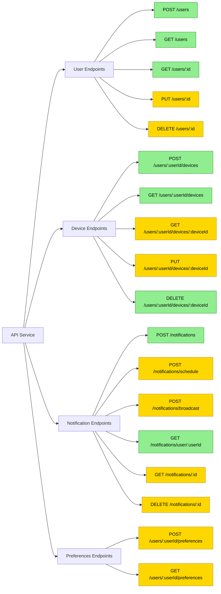
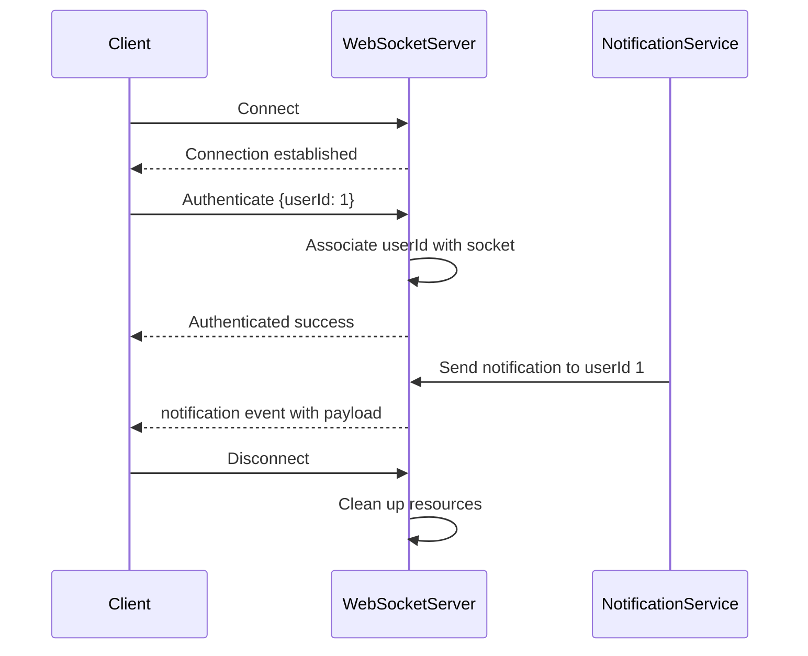

# Push Notification Service API Documentation

## Introduction

This document provides detailed information about the Push Notification Service API, which allows you to manage users, devices, and send notifications through various channels.

**Implementation Status Legend**:
- ✅ Implemented - Available in current version
- ⚠️ Partial - Partially implemented with limited functionality
- 🔄 Planned - Planned for future implementation

## Base URL

```
https://your-domain.com/api
```

For local development:
```
http://localhost:3001/api
```

## Authentication

> **Status: 🔄 Planned**

Authentication will be implemented in a future version. Currently, all endpoints can be accessed without authentication.

Future implementation will include API key authentication:
```
X-API-Key: your_api_key_here
```

## API Endpoints Overview



## API Endpoints

### User Management

#### Create User ✅

Creates a new user in the system.

**Endpoint:** `POST /users`

**Request Body:**
```json
{
  "email": "john.doe@example.com"
}
```

**Note:** While the database schema includes `name` and `phone` fields, the current API implementation only requires the `email` field.

**Response:** `201 Created`
```json
{
  "id": 1,
  "email": "john.doe@example.com",
  "created_at": "2023-05-01T12:00:00Z"
}
```

**Error Responses:**
- `400 Bad Request`: Missing required fields
- `500 Internal Server Error`: Server error

#### Get All Users ✅

Retrieves a list of all users.

**Endpoint:** `GET /users`

**Response:** `200 OK`
```json
[
  {
    "id": 1,
    "email": "john.doe@example.com",
    "created_at": "2023-05-01T12:00:00Z"
  },
  {
    "id": 2,
    "email": "jane.smith@example.com",
    "created_at": "2023-05-02T10:30:00Z"
  }
]
```

**Error Responses:**
- `500 Internal Server Error`: Server error

#### Get User by ID ✅

Retrieves a specific user by their ID.

**Endpoint:** `GET /users/:id`

**URL Parameters:**
- `id`: User ID (required)

**Response:** `200 OK`
```json
{
  "id": 1,
  "email": "john.doe@example.com",
  "created_at": "2023-05-01T12:00:00Z"
}
```

**Error Responses:**
- `404 Not Found`: User not found
- `500 Internal Server Error`: Server error

#### Update User 🔄

Updates an existing user (planned for future implementation).

**Endpoint:** `PUT /users/:id`

**URL Parameters:**
- `id`: User ID (required)

**Request Body:**
```json
{
  "email": "john.updated@example.com"
}
```

**Response:** `200 OK`
```json
{
  "id": 1,
  "email": "john.updated@example.com",
  "updated_at": "2023-05-05T14:20:00Z",
  "created_at": "2023-05-01T12:00:00Z"
}
```

**Error Responses:**
- `400 Bad Request`: Invalid input
- `404 Not Found`: User not found
- `500 Internal Server Error`: Server error

#### Delete User 🔄

Deletes a user from the system (planned for future implementation).

**Endpoint:** `DELETE /users/:id`

**URL Parameters:**
- `id`: User ID (required)

**Response:** `204 No Content`

**Error Responses:**
- `404 Not Found`: User not found
- `500 Internal Server Error`: Server error

### Device Management

#### Register Device ✅

Registers a new device for a user.

**Endpoint:** `POST /users/:userId/devices`

**URL Parameters:**
- `userId`: User ID (required)

**Request Body:**
```json
{
  "device_token": "fcm-token-abc123",
  "device_type": "android"  // Supported types: "android", "ios", "web"
}
```

**Response:** `201 Created`
```json
{
  "id": 1,
  "user_id": 1,
  "device_token": "fcm-token-abc123",
  "device_type": "android",
  "created_at": "2023-05-01T12:30:00Z"
}
```

**Error Responses:**
- `400 Bad Request`: Missing required fields or invalid device type
- `404 Not Found`: User not found
- `500 Internal Server Error`: Server error

#### Get User's Devices ✅

Retrieves all devices registered for a specific user.

**Endpoint:** `GET /users/:userId/devices`

**URL Parameters:**
- `userId`: User ID (required)

**Response:** `200 OK`
```json
[
  {
    "id": 1,
    "user_id": 1,
    "device_token": "fcm-token-abc123",
    "device_type": "android",
    "created_at": "2023-05-01T12:30:00Z"
  },
  {
    "id": 2,
    "user_id": 1,
    "device_token": "apns-token-xyz987",
    "device_type": "ios",
    "created_at": "2023-05-02T15:45:00Z"
  }
]
```

**Error Responses:**
- `404 Not Found`: User not found
- `500 Internal Server Error`: Server error

#### Get Device by ID 🔄

Retrieves a specific device (planned for future implementation).

**Endpoint:** `GET /users/:userId/devices/:deviceId`

**URL Parameters:**
- `userId`: User ID (required)
- `deviceId`: Device ID (required)

**Response:** `200 OK`
```json
{
  "id": 1,
  "user_id": 1,
  "device_token": "fcm-token-abc123",
  "device_type": "android",
  "created_at": "2023-05-01T12:30:00Z"
}
```

**Error Responses:**
- `404 Not Found`: User or device not found
- `500 Internal Server Error`: Server error

#### Update Device 🔄

Updates an existing device (planned for future implementation).

**Endpoint:** `PUT /users/:userId/devices/:deviceId`

**URL Parameters:**
- `userId`: User ID (required)
- `deviceId`: Device ID (required)

**Request Body:**
```json
{
  "device_token": "fcm-token-updated456"
}
```

**Response:** `200 OK`
```json
{
  "id": 1,
  "user_id": 1,
  "device_token": "fcm-token-updated456",
  "device_type": "android",
  "updated_at": "2023-05-10T09:15:00Z",
  "created_at": "2023-05-01T12:30:00Z"
}
```

**Error Responses:**
- `404 Not Found`: User or device not found
- `500 Internal Server Error`: Server error

#### Unregister Device ✅

Removes a device from the system.

**Endpoint:** `DELETE /users/:userId/devices/:deviceId`

**URL Parameters:**
- `userId`: User ID (required)
- `deviceId`: Device ID (required)

**Response:** `204 No Content`

**Error Responses:**
- `404 Not Found`: User or device not found
- `500 Internal Server Error`: Server error

### Notification Management

#### Send Immediate Notification ✅

Sends a notification immediately to a user.

**Endpoint:** `POST /notifications`

**Request Body:**
```json
{
  "user_id": 1,
  "title": "New Message",
  "body": "You have received a new message from Jane",
  "data": {
    "message_id": 123,
    "sender_id": 2,
    "sender_name": "Jane Smith",
    "thread_id": 456
  }
}
```

**Response:** `202 Accepted`
```json
{
  "id": 1,
  "user_id": 1,
  "title": "New Message",
  "body": "You have received a new message from Jane",
  "data": {
    "message_id": 123,
    "sender_id": 2,
    "sender_name": "Jane Smith",
    "thread_id": 456
  },
  "status": "pending",
  "created_at": "2023-05-05T13:40:00Z"
}
```

**Error Responses:**
- `400 Bad Request`: Missing required fields
- `404 Not Found`: User not found
- `500 Internal Server Error`: Server error

#### Schedule Notification ⚠️

Schedules a notification to be sent at a future time. Backend worker is partially implemented, but API endpoint is still planned.

**Status: Partially implemented**

**Endpoint:** `POST /notifications/schedule`

**Request Body:**
```json
{
  "user_id": 1,
  "title": "Meeting Reminder",
  "body": "Your meeting with the team starts in 15 minutes",
  "data": {
    "meeting_id": 789,
    "meeting_link": "https://meet.example.com/abc123"
  },
  "scheduled_time": "2023-05-10T15:45:00Z"
}
```

**Response:** `202 Accepted`
```json
{
  "id": 2,
  "user_id": 1,
  "title": "Meeting Reminder",
  "body": "Your meeting with the team starts in 15 minutes",
  "data": {
    "meeting_id": 789,
    "meeting_link": "https://meet.example.com/abc123"
  },
  "status": "scheduled",
  "scheduled_time": "2023-05-10T15:45:00Z",
  "created_at": "2023-05-05T14:00:00Z"
}
```

**Error Responses:**
- `400 Bad Request`: Missing required fields or invalid scheduled time
- `404 Not Found`: User not found
- `500 Internal Server Error`: Server error

#### Broadcast Notification 🔄

Sends a notification to all users in the system (planned for future implementation).

**Endpoint:** `POST /notifications/broadcast`

**Request Body:**
```json
{
  "title": "System Maintenance",
  "body": "The system will be down for maintenance tonight from 2:00 AM to 4:00 AM",
  "data": {
    "maintenance_id": 55,
    "more_info": "https://status.example.com"
  }
}
```

**Response:** `202 Accepted`
```json
{
  "id": 3,
  "title": "System Maintenance",
  "body": "The system will be down for maintenance tonight from 2:00 AM to 4:00 AM",
  "data": {
    "maintenance_id": 55,
    "more_info": "https://status.example.com"
  },
  "status": "pending",
  "broadcast": true,
  "created_at": "2023-05-05T16:20:00Z"
}
```

**Error Responses:**
- `400 Bad Request`: Missing required fields
- `500 Internal Server Error`: Server error

#### Get User's Notifications ✅

Retrieves all notifications for a specific user.

**Endpoint:** `GET /notifications/user/:userId`

**URL Parameters:**
- `userId`: User ID (required)

**Response:** `200 OK`
```json
[
  {
    "id": 1,
    "user_id": 1,
    "title": "New Message",
    "body": "You have received a new message from Jane",
    "status": "delivered",
    "sent_at": "2023-05-05T13:40:10Z",
    "created_at": "2023-05-05T13:40:00Z"
  }
]
```

**Error Responses:**
- `404 Not Found`: User not found
- `500 Internal Server Error`: Server error

#### Get Notification by ID 🔄

Retrieves a specific notification (planned for future implementation).

**Endpoint:** `GET /notifications/:id`

**URL Parameters:**
- `id`: Notification ID (required)

**Response:** `200 OK`
```json
{
  "id": 1,
  "user_id": 1,
  "title": "New Message",
  "body": "You have received a new message from Jane",
  "data": {
    "message_id": 123,
    "sender_id": 2,
    "sender_name": "Jane Smith",
    "thread_id": 456
  },
  "status": "delivered",
  "sent_at": "2023-05-05T13:40:10Z",
  "created_at": "2023-05-05T13:40:00Z"
}
```

**Error Responses:**
- `404 Not Found`: Notification not found
- `500 Internal Server Error`: Server error

#### Cancel Scheduled Notification 🔄

Cancels a scheduled notification that hasn't been sent yet (planned for future implementation).

**Endpoint:** `DELETE /notifications/:id`

**URL Parameters:**
- `id`: Notification ID (required)

**Response:** `204 No Content`

**Error Responses:**
- `404 Not Found`: Notification not found
- `409 Conflict`: Notification already sent
- `500 Internal Server Error`: Server error

### User Preferences 🔄

> **Status: 🔄 Planned**

User preference endpoints are planned for future implementation.

#### Set User Preferences 🔄

Sets notification preferences for a user (planned for future implementation).

**Endpoint:** `POST /users/:userId/preferences`

**URL Parameters:**
- `userId`: User ID (required)

**Request Body:**
```json
{
  "notification_types": [
    "message",
    "reminder",
    "system_announcement"
  ],
  "quiet_hours": {
    "enabled": true,
    "start_time": "22:00",
    "end_time": "08:00",
    "timezone": "America/New_York"
  },
  "delivery_channels": {
    "push": true,
    "email": true,
    "sms": false
  }
}
```

**Response:** `200 OK`
```json
{
  "user_id": 1,
  "notification_types": [
    "message",
    "reminder",
    "system_announcement"
  ],
  "quiet_hours": {
    "enabled": true,
    "start_time": "22:00",
    "end_time": "08:00",
    "timezone": "America/New_York"
  },
  "delivery_channels": {
    "push": true,
    "email": true,
    "sms": false
  },
  "updated_at": "2023-05-06T10:15:00Z"
}
```

**Error Responses:**
- `400 Bad Request`: Invalid preferences format
- `404 Not Found`: User not found
- `500 Internal Server Error`: Server error

#### Get User Preferences 🔄

Retrieves notification preferences for a user (planned for future implementation).

**Endpoint:** `GET /users/:userId/preferences`

**URL Parameters:**
- `userId`: User ID (required)

**Response:** `200 OK`
```json
{
  "user_id": 1,
  "notification_types": [
    "message",
    "reminder",
    "system_announcement"
  ],
  "quiet_hours": {
    "enabled": true,
    "start_time": "22:00",
    "end_time": "08:00",
    "timezone": "America/New_York"
  },
  "delivery_channels": {
    "push": true,
    "email": true,
    "sms": false
  },
  "updated_at": "2023-05-06T10:15:00Z",
  "created_at": "2023-05-06T10:15:00Z"
}
```

**Error Responses:**
- `404 Not Found`: User or preferences not found
- `500 Internal Server Error`: Server error

## WebSocket API ✅

The Push Notification Service provides a WebSocket API for real-time notifications.



### Connection

Connect to the WebSocket server:

```
ws://your-domain.com
```

For local development:
```
ws://localhost:3000
```

### Authentication

After connecting, authenticate the WebSocket connection:

```javascript
// Client-side example
const socket = io('http://localhost:3000');

socket.emit('authenticate', { userId: 1 });

socket.on('authenticated', (response) => {
  console.log('Authentication successful', response);
});

socket.on('error', (error) => {
  console.error('Authentication failed', error);
});
```

### Receiving Notifications

Listen for notification events:

```javascript
// Client-side example
socket.on('notification', (notification) => {
  console.log('New notification received', notification);
  // Handle the notification in your UI
});
```

### Disconnection

Handle disconnection events:

```javascript
// Client-side example
socket.on('disconnect', (reason) => {
  console.log('Disconnected from WebSocket server', reason);
  
  // Attempt to reconnect if appropriate
  setTimeout(() => {
    socket.connect();
  }, 5000);
});
```

## Error Codes and Messages

The API may return the following error codes:

| HTTP Status | Error Code | Description |
|-------------|------------|-------------|
| 400 | INVALID_REQUEST | The request is malformed or missing required fields |
| 401 | UNAUTHORIZED | Authentication failed |
| 403 | FORBIDDEN | The authenticated user doesn't have permission |
| 404 | NOT_FOUND | The requested resource was not found |
| 409 | CONFLICT | The request conflicts with the current state of the server |
| 500 | SERVER_ERROR | An internal server error occurred |

Error response format:

```json
{
  "error": "Error message"
}
```

## Rate Limiting 🔄

> **Status: 🔄 Planned**

Rate limiting is planned for future implementation.

## Webhook Integration 🔄

> **Status: 🔄 Planned**

Webhook integration is planned for future implementation.
