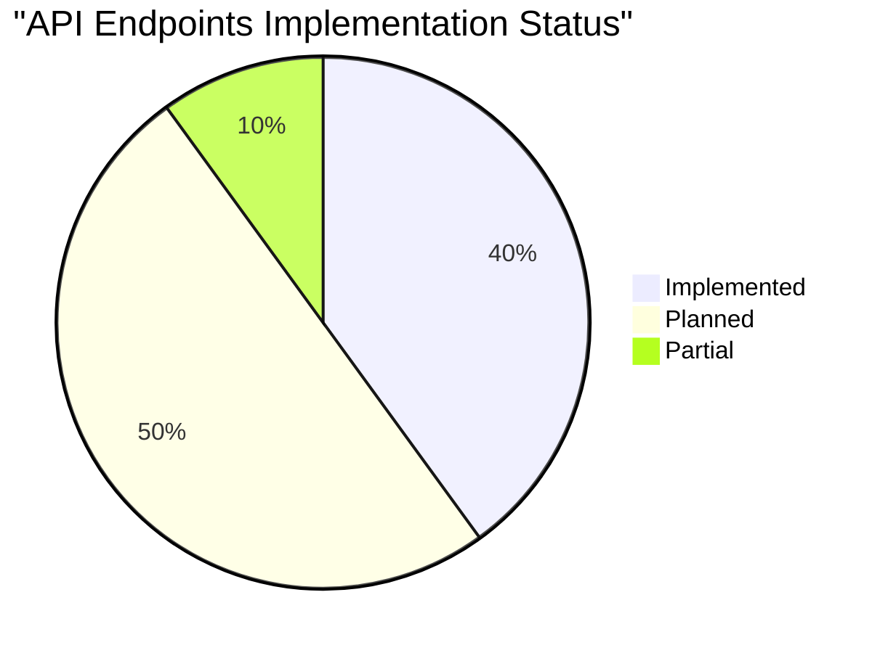
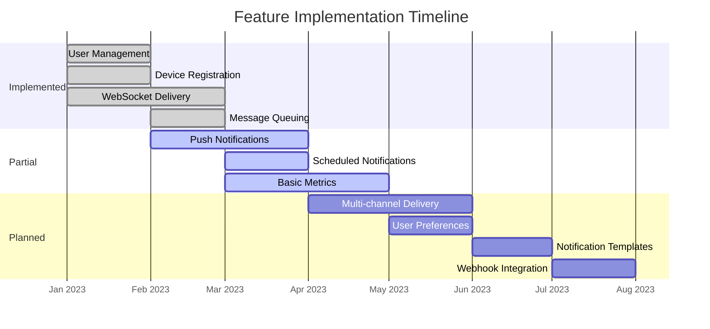

# Implementation Status

This document provides a detailed overview of the current implementation status of the Push Notification Service, helping you understand which features are available now and which are planned for future releases.

## Core Components

| Component | Status | Notes |
|-----------|--------|-------|
| API Server | ✅ Implemented | Express server with routes for users, devices, and notifications |
| Database | ✅ Implemented | PostgreSQL with basic schema |
| WebSocket Server | ✅ Implemented | Socket.IO integration for real-time notifications |
| Message Queue | ✅ Implemented | RabbitMQ integration for notification processing |
| Redis | ⚠️ Partial | Basic integration, not fully utilized for features beyond presence |
| Notification Workers | ⚠️ Partial | Immediate notification worker implemented; scheduled notifications partially implemented |
| Monitoring | ⚠️ Partial | Prometheus metrics defined but dashboard not fully implemented |
| Logging | ⚠️ Partial | Winston logger implemented but no ELK stack integration |
| Docker | ✅ Implemented | Docker and Docker Compose for development |

## API Endpoints

### User Management

| Endpoint | Method | Status | Notes |
|----------|--------|--------|-------|
| `/api/users` | POST | ✅ Implemented | Create a new user |
| `/api/users` | GET | ✅ Implemented | Get all users |
| `/api/users/:id` | GET | ✅ Implemented | Get a specific user |
| `/api/users/:id` | PUT | 🔄 Planned | Update a user |
| `/api/users/:id` | DELETE | 🔄 Planned | Delete a user |

### Device Management

| Endpoint | Method | Status | Notes |
|----------|--------|--------|-------|
| `/api/users/:userId/devices` | POST | ✅ Implemented | Register a device for a user |
| `/api/users/:userId/devices` | GET | ✅ Implemented | Get all devices for a user |
| `/api/users/:userId/devices/:deviceId` | GET | 🔄 Planned | Get a specific device |
| `/api/users/:userId/devices/:deviceId` | PUT | 🔄 Planned | Update a device |
| `/api/users/:userId/devices/:deviceId` | DELETE | ✅ Implemented | Unregister a device |

### Notification Management

| Endpoint | Method | Status | Notes |
|----------|--------|--------|-------|
| `/api/notifications` | POST | ✅ Implemented | Send an immediate notification |
| `/api/notifications/user/:userId` | GET | ✅ Implemented | Get notifications for a user |
| `/api/notifications/schedule` | POST | ⚠️ Partial | Schedule a notification for future delivery (worker partially implemented) |
| `/api/notifications/broadcast` | POST | 🔄 Planned | Send to all users |
| `/api/notifications/:id` | GET | 🔄 Planned | Get a specific notification |
| `/api/notifications/:id` | DELETE | 🔄 Planned | Cancel a scheduled notification |

### User Preferences

| Endpoint | Method | Status | Notes |
|----------|--------|--------|-------|
| `/api/users/:userId/preferences` | POST | 🔄 Planned | Set notification preferences |
| `/api/users/:userId/preferences` | GET | 🔄 Planned | Get notification preferences |

## Database Schema

| Table | Status | Notes |
|-------|--------|-------|
| `users` | ✅ Implemented | Basic user information |
| `devices` | ✅ Implemented | User device registration |
| `notifications` | ✅ Implemented | Basic notification data |
| `user_preferences` | ⚠️ Schema Only | Table defined but not used in application code |
| `sent_notifications` | ⚠️ Schema Only | Table defined but not used in application code |
| `failed_notifications` | ⚠️ Schema Only | Table defined but not used in application code |
| `notification_logs` | ⚠️ Schema Only | Table defined but not used in application code |
| `email_logs` | ⚠️ Schema Only | Table defined but not used in application code |
| `sms_logs` | ⚠️ Schema Only | Table defined but not used in application code |
| `push_notification_logs` | ⚠️ Schema Only | Table defined but not used in application code |
| `webhook_logs` | ⚠️ Schema Only | Table defined but not used in application code |

## Model Implementation

| Model | Status | Notes |
|-------|--------|-------|
| `User` | ⚠️ Partial | Implemented but missing `name` and `phone` fields from database schema |
| `Device` | ✅ Implemented | User device model |
| `Notification` | ✅ Implemented | Basic notification model |
| `UserPreferences` | 🔄 Planned | Schema exists but model not implemented |
| `SentNotification` | 🔄 Planned | Schema exists but model not implemented |
| `NotificationLog` | 🔄 Planned | Schema exists but model not implemented |

## Features

| Feature | Status | Notes |
|---------|--------|-------|
| User Management | ⚠️ Partial | Basic CRUD operations (except update/delete) |
| Device Registration | ✅ Implemented | Register and unregister devices |
| Push Notifications | ⚠️ Partial | Basic immediate notification via WebSocket implemented |
| WebSocket Delivery | ✅ Implemented | Real-time notification delivery |
| Message Queuing | ✅ Implemented | RabbitMQ integration |
| Scheduled Notifications | ⚠️ Partial | Worker exists but API endpoint not implemented |
| Multi-channel Delivery | 🔄 Planned | Currently WebSocket only, email/SMS planned |
| Notification Templates | 🔄 Planned | For future implementation |
| User Preferences | 🔄 Planned | Schema exists but not implemented |
| Delivery Tracking | ⚠️ Partial | Basic status tracking only, detailed tracking planned |
| Webhook Integration | 🔄 Planned | Schema exists but not implemented |

## Monitoring & Logging

| Feature | Status | Notes |
|---------|--------|-------|
| Prometheus Metrics | ⚠️ Partial | Metrics defined but dashboard not fully implemented |
| Winston Logging | ✅ Implemented | Basic logging to console |
| ELK Stack | 🔄 Planned | Configuration exists but not fully integrated |
| Grafana Dashboards | 🔄 Planned | For future implementation |

## Development Tools

| Tool | Status | Notes |
|------|--------|-------|
| Docker | ✅ Implemented | Docker and Docker Compose setup |
| Database Seeder | ✅ Implemented | For generating test data |
| Test Suite | 🔄 Planned | For future implementation |
| CI/CD | 🔄 Planned | For future implementation |

## Legend

- ✅ Implemented - Feature is fully implemented and available
- ⚠️ Partial - Feature is partially implemented with limited functionality
- 🔄 Planned - Feature is planned for future implementation

## Roadmap

### Short-term (Next Release)

1. Fix User model to match database schema (add name and phone fields)
2. Implement scheduled notifications API endpoint
3. Create models for user preferences and notification logs
4. Improve Redis integration for better caching and rate limiting

### Mid-term

1. Implement multi-channel delivery (email, SMS)
2. Add user preferences functionality
3. Implement notification templates
4. Complete ELK stack integration

### Long-term

1. Implement webhook integration
2. Add advanced analytics
3. Implement notification batching
4. Add A/B testing capabilities