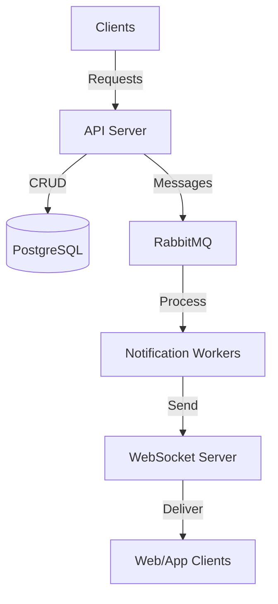

# Push Notification Service

A scalable and robust service for managing and delivering push notifications across multiple channels.

## Overview

The Push Notification Service is a microservice-based platform designed to handle notification delivery with a focus on real-time push notifications and WebSocket delivery. The service is being developed incrementally, with more features planned for future releases.

## Implementation Status

The current implementation includes:

✅ **Core API server** - RESTful API for managing users, devices, and basic notifications  
✅ **Basic database integration** - PostgreSQL for storing entity data  
✅ **WebSocket notifications** - Real-time delivery to connected clients  
✅ **User and device management** - Registration and lookup functionality  
✅ **Basic notification sending** - Immediate notification delivery  
✅ **Message queueing** - RabbitMQ integration for notification processing  
⚠️ **Scheduled notifications** - Worker implementation exists but API endpoint is not yet implemented  
⚠️ **Basic metrics** - Prometheus integration for system monitoring (dashboard not complete)  
✅ **Containerization** - Docker and Docker Compose setup  
✅ **Test data generation** - Database seeder for development  

**Planned for future releases:**

🔄 Multi-channel delivery (email, SMS)  
🔄 Comprehensive delivery tracking  
🔄 User preferences  
🔄 Notification templates  
🔄 Webhook integration  
🔄 Advanced metrics and dashboards  
🔄 Full ELK stack integration  

For detailed status information, see the [Implementation Status](./implementation-status.md) document.

## Features

Current features:

- **Real-time notifications** - WebSocket support for instant delivery
- **Message queueing** - RabbitMQ for reliable message delivery
- **Basic monitoring** - Prometheus integration for system metrics
- **Centralized logging** - Winston logger for aggregating logs
- **User management** - Basic API for user management
- **Device management** - Register/unregister devices for notifications

Features planned for future releases:

- Multi-channel delivery (email, SMS)
- Notification scheduling
- Delivery status tracking
- User notification preferences
- Notification templates

## System Architecture

The Push Notification Service follows a microservice architecture with the following components:

### Current Architecture



### Components

#### Currently Implemented

- **PostgreSQL**: Primary database for storing user data, device information, and notification history
- **RabbitMQ**: Message broker for managing notification queues
- **API Server**: RESTful API for managing users, devices, and notifications
- **WebSocket Server**: Real-time notification delivery
- **Notification Workers**: Process and send notifications from queues

#### Partially Implemented

- **Redis**: For basic user presence and WebSocket connection tracking
- **Prometheus**: For basic metrics collection

#### Planned for Future Implementation

- **Full Redis Integration**: Enhanced caching, rate limiting, and managing WebSocket connections
- **ELK Stack**: Elasticsearch, Logstash, and Kibana for log management
- **Grafana**: For metrics visualization

## Documentation Guide

The documentation for this project is organized into several documents to help you understand and use the system effectively:

1. **Introduction** (this document) - Overview and gateway to other documentation
2. **[Setup Guide](./setup-and-configuration.md)** - Detailed installation and configuration instructions
3. **[API Documentation](./api.md)** - Complete API reference for all endpoints
4. **[Technical Documentation](./technical-docs.md)** - Detailed technical implementation details
5. **[Implementation Status](./implementation-status.md)** - Detailed status of features and components

## Getting Started

### Prerequisites

- Docker and Docker Compose
- Node.js (v16+) for local development
- PostgreSQL client (optional, for direct DB access)

### Quick Start

1. Clone the repository:
   ```bash
   git clone https://github.com/yourusername/push-notification-service.git
   cd push-notification-service
   ```

2. Setup environment:
   ```bash
   chmod +X setup.sh
   ./setup.sh
   ```

3. Start the services with Docker Compose:
   ```bash
   docker-compose up -d
   ```

4. Verify the installation:
   ```bash
   # Check if all services are running
   docker-compose ps
   
   # Check API availability
   curl http://localhost:3001/api/healthcheck
   ```

For more detailed setup instructions, refer to the [Setup Guide](./setup-and-configuration.md).

## API Reference

The service provides a RESTful API for managing users, devices, and notifications. Below are the currently implemented endpoints:

### Authentication

API authentication system is planned for future implementation. Currently, endpoints are accessible without authentication.

### Currently Implemented Endpoints

#### User Management

- `POST /api/users` - Create a new user
- `GET /api/users` - Get all users
- `GET /api/users/:id` - Get a specific user by ID

#### Device Management

- `POST /api/users/:userId/devices` - Register a new device for a user
- `GET /api/users/:userId/devices` - Get all devices for a user
- `DELETE /api/users/:userId/devices/:deviceId` - Unregister a device

#### Notification Management

- `POST /api/notifications` - Send an immediate notification
- `GET /api/notifications/user/:userId` - Get notifications for a user

For complete API documentation including planned endpoints, refer to the [API Documentation](./api.md).

## WebSocket Interface

The service provides a WebSocket interface for real-time notifications.

### Connection

Connect to the WebSocket server:

```
ws://your-domain.com
```

For local development:
```
ws://localhost:3000
```

### Authentication

After connecting, authenticate the WebSocket connection:

```javascript
// Client-side example
const socket = io('http://localhost:3001');
socket.emit('authenticate', { userId: 1 });

socket.on('authenticated', (response) => {
  console.log('Authentication successful', response);
});

socket.on('error', (error) => {
  console.error('Authentication failed', error);
});
```

### Receiving Notifications

Listen for notification events:

```javascript
// Client-side example
socket.on('notification', (notification) => {
  console.log('New notification received', notification);
  // Handle the notification in your UI
});
```

## Contributing

Contributions are welcome! Please read our contributing guidelines before submitting pull requests.

### Development Setup

1. Install dependencies:
   ```bash
   npm install
   ```

2. Start necessary services in development mode:
   ```bash
   docker-compose up -d postgres rabbitmq
   npm run dev
   ```

For more information on development workflow, check the [Technical Documentation](./technical-docs.md).
